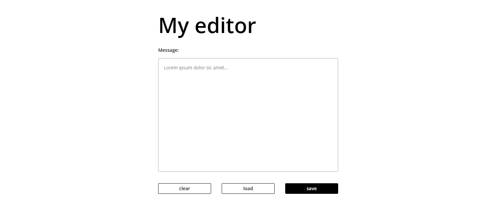

# Simple Editor 

Simple editor with local storage support:
[My editor](https://anastazjasta.github.io/simple-editor/)

## How to run the page locally
To run the page locally enter following commands:

`npm install -g gulp-cli`

`npm install`

`gulp`

To publish page using github pages use `npm run deploy`
